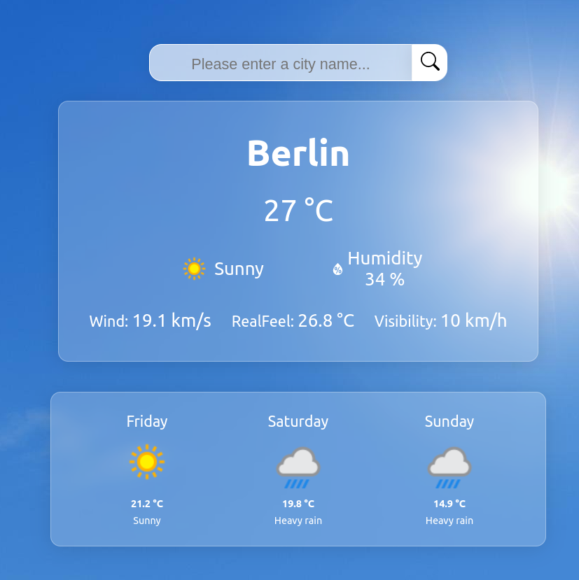

# Weather App Project

### Demo: [click](https://weather-app-react-sevde.netlify.app)

---

## Properties

1. It is a react project.

2. Weather information was fetched from [www.weatherapi.com](www.weatherapi.com]) with Axios API.

3. Showing the weather information of the city entered in the input

4. Showing the weather forecast for 3 days from the current day.

5. Changing background depending on the weather condition

---

# Screenshots

